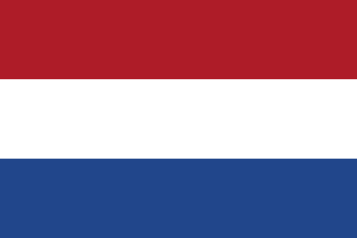
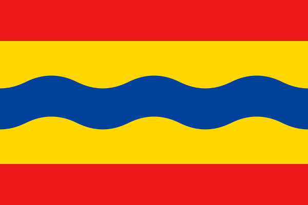

Afbeeldingslagen voor JOSM
==========================

Klik hieronder op een afbeeldingslaag om deze toe te voegen in JOSM via de afstandsbediening.

|      | Afbeeldingslaag | Interne naam en UUID |
| :--- | :-------------- | :------------------- |
|  | [NWB wegbeheerder](http://127.0.0.1:8111/imagery?title=NWB+wegbeheerder&attribution-text=Rijkswaterstaat&attribution-url=https%3A%2F%2Fwww.rijkswaterstaat.nl%2F&valid-georeference=true&overlay=true&transparent=true&type=wms&min_zoom=14&url=https%3A%2F%2Fgeo.rijkswaterstaat.nl%2Fservices%2Fogc%2Fgdr%2Fnwb_wegen%2Fows%3FFORMAT%3Dimage%2Fpng%26TRANSPARENT%3DTRUE%26VERSION%3D1.3.0%26SERVICE%3DWMS%26REQUEST%3DGetMap%26LAYERS%3Dwegvakken%26STYLES%3D%26CRS%3D%7Bproj%7D%26WIDTH%3D%7Bwidth%7D%26HEIGHT%3D%7Bheight%7D%26BBOX%3D%7Bbbox%7D) | NWB wegen - Wegvakken (RWS) `60caa9e5-60c5-4072-a575-e11ef5a07mgl` (bron: [Rijkswaterstaat](https://www.rijkswaterstaat.nl/)) |
|  | [WEGGEG bebouwde kom](http://127.0.0.1:8111/imagery?title=WEGGEG+bebouwde+kom&attribution-text=Rijkswaterstaat&attribution-url=https%3A%2F%2Fwww.rijkswaterstaat.nl%2F&valid-georeference=true&overlay=true&transparent=true&type=wms&min_zoom=14&url=https%3A%2F%2Fgeo.rijkswaterstaat.nl%2Fservices%2Fogc%2Fgdr%2Fweggeg%2Fows%3FFORMAT%3Dimage%2Fpng%26TRANSPARENT%3DTRUE%26VERSION%3D1.3.0%26SERVICE%3DWMS%26REQUEST%3DGetMap%26LAYERS%3Dweggeg%3Abebouwde_kommen_wegvak%26STYLES%3D%26CRS%3D%7Bproj%7D%26WIDTH%3D%7Bwidth%7D%26HEIGHT%3D%7Bheight%7D%26BBOX%3D%7Bbbox%7D) | Wegkenmerk maximum snelheden met geometrie op wegvakniveau (RWS): bebouwde_kommen_wegvak `abbf1e22-55aa-4a11-a855-7ac963e4a82c` (bron: [Rijkswaterstaat](https://www.rijkswaterstaat.nl/)) |
|  | [WEGGEG wegcategorie](http://127.0.0.1:8111/imagery?title=WEGGEG+wegcategorie&attribution-text=Rijkswaterstaat&attribution-url=https%3A%2F%2Fwww.rijkswaterstaat.nl%2F&valid-georeference=true&overlay=true&transparent=true&type=wms&min_zoom=14&url=https%3A%2F%2Fgeo.rijkswaterstaat.nl%2Fservices%2Fogc%2Fgdr%2Fweggeg%2Fows%3FFORMAT%3Dimage%2Fpng%26TRANSPARENT%3DTRUE%26VERSION%3D1.3.0%26SERVICE%3DWMS%26REQUEST%3DGetMap%26LAYERS%3Dweggeg%3Awegcategorie_formeel_wegvak%26STYLES%3D%26CRS%3D%7Bproj%7D%26WIDTH%3D%7Bwidth%7D%26HEIGHT%3D%7Bheight%7D%26BBOX%3D%7Bbbox%7D) | Wegkenmerk wegcategorie formeel met geometrie op wegvakniveau (RWS): wegcategorie_formeel_wegvak `abbf1e22-55aa-4a11-a855-7ac963e4a82c` (bron: [Rijkswaterstaat](https://www.rijkswaterstaat.nl/)) |
|  | [WEGGEG maximumsnelheid dag](http://127.0.0.1:8111/imagery?title=WEGGEG+maximumsnelheid+dag&attribution-text=Rijkswaterstaat&attribution-url=https%3A%2F%2Fwww.rijkswaterstaat.nl%2F&valid-georeference=true&overlay=true&transparent=true&type=wms&min_zoom=14&url=https%3A%2F%2Fgeo.rijkswaterstaat.nl%2Fservices%2Fogc%2Fgdr%2Fweggeg%2Fows%3FFORMAT%3Dimage%2Fpng%26TRANSPARENT%3DTRUE%26VERSION%3D1.3.0%26SERVICE%3DWMS%26REQUEST%3DGetMap%26LAYERS%3Dweggeg%3Amaximum_snelheden_wegvak_overdag%26STYLES%3D%26CRS%3D%7Bproj%7D%26WIDTH%3D%7Bwidth%7D%26HEIGHT%3D%7Bheight%7D%26BBOX%3D%7Bbbox%7D) | Wegkenmerk maximum snelheden met geometrie op wegvakniveau (RWS): maximum_snelheden_wegvak_overdag `abbf1e22-55aa-4a11-a855-7ac963e4a82c` (bron: [Rijkswaterstaat](https://www.rijkswaterstaat.nl/)) |
|  | [WEGGEG maximumsnelheid nacht](http://127.0.0.1:8111/imagery?title=WEGGEG+maximumsnelheid+nacht&attribution-text=Rijkswaterstaat&attribution-url=https%3A%2F%2Fwww.rijkswaterstaat.nl%2F&valid-georeference=true&overlay=true&transparent=true&type=wms&min_zoom=14&url=https%3A%2F%2Fgeo.rijkswaterstaat.nl%2Fservices%2Fogc%2Fgdr%2Fweggeg%2Fows%3FFORMAT%3Dimage%2Fpng%26TRANSPARENT%3DTRUE%26VERSION%3D1.3.0%26SERVICE%3DWMS%26REQUEST%3DGetMap%26LAYERS%3Dweggeg%3Amaximum_snelheden_wegvak_nacht%26STYLES%3D%26CRS%3D%7Bproj%7D%26WIDTH%3D%7Bwidth%7D%26HEIGHT%3D%7Bheight%7D%26BBOX%3D%7Bbbox%7D) | Wegkenmerk maximum snelheden met geometrie op wegvakniveau (RWS): maximum_snelheden_wegvak_nacht `abbf1e22-55aa-4a11-a855-7ac963e4a82c` (bron: [Rijkswaterstaat](https://www.rijkswaterstaat.nl/)) |
|  | [KernGis beheergrens](http://127.0.0.1:8111/imagery?title=KernGis+beheergrens&attribution-text=Rijkswaterstaat&attribution-url=https%3A%2F%2Fwww.rijkswaterstaat.nl%2F&valid-georeference=true&overlay=true&transparent=true&type=wms&min_zoom=14&url=https%3A%2F%2Fgeo.rijkswaterstaat.nl%2Fservices%2Fogc%2Fgdr%2Fkerngis_droog%2Fows%3FFORMAT%3Dimage%2Fpng%26TRANSPARENT%3DTRUE%26VERSION%3D1.3.0%26SERVICE%3DWMS%26REQUEST%3DGetMap%26LAYERS%3Dkerngis_droog%3Abeheergebied_vlakken%26STYLES%3D%26CRS%3D%7Bproj%7D%26WIDTH%3D%7Bwidth%7D%26HEIGHT%3D%7Bheight%7D%26BBOX%3D%7Bbbox%7D) | Beheersituatie KernGis (vlakken) `5cb74c48-bd97-4d51-aab2-a883ea26811f` (bron: [Rijkswaterstaat](https://www.rijkswaterstaat.nl/)) |
|  | [Overijssel wegcategorie](http://127.0.0.1:8111/imagery?title=Overijssel+wegcategorie&attribution-text=Provincie+Overijssel&attribution-url=https%3A%2F%2Fwww.overijssel.nl%2F&valid-georeference=true&overlay=true&transparent=true&type=wms&min_zoom=14&url=https%3A%2F%2Fservices.geodataoverijssel.nl%2Fgeoserver%2FB22_wegen%2Fows%3FFORMAT%3Dimage%2Fpng%26TRANSPARENT%3DTRUE%26VERSION%3D1.3.0%26SERVICE%3DWMS%26REQUEST%3DGetMap%26LAYERS%3DB22_Wegencategorisering_op_provinciale_wegen_in_Overijssel%26STYLES%3D%26CRS%3D%7Bproj%7D%26WIDTH%3D%7Bwidth%7D%26HEIGHT%3D%7Bheight%7D%26BBOX%3D%7Bbbox%7D) | Wegencategorisering op provinciale wegen `e0820849-76dd-4943-ad67-e9046da704a1` (bron: [Provincie Overijssel](https://www.overijssel.nl/)) |
|  | [Gelderland beheergrens](http://127.0.0.1:8111/imagery?title=Gelderland+beheergrens&attribution-text=Provincie+Gelderland&attribution-url=https%3A%2F%2Fwww.gelderland.nl%2F&valid-georeference=true&overlay=true&transparent=true&type=wms&min_zoom=14&url=https%3A%2F%2Fgeoserver.gelderland.nl%2Fgeoserver%2Fngr_bow%2Fows%3FFORMAT%3Dimage%2Fpng%26TRANSPARENT%3DTRUE%26VERSION%3D1.3.0%26SERVICE%3DWMS%26REQUEST%3DGetMap%26LAYERS%3DGzEg_Beheergebied%26STYLES%3D%26CRS%3D%7Bproj%7D%26WIDTH%3D%7Bwidth%7D%26HEIGHT%3D%7Bheight%7D%26BBOX%3D%7Bbbox%7D) | Grenzen- Beheergebied provinciale wegen `4d16044c-f6a3-4c4d-9b03-df9f49a056dc` (bron: [Provincie Gelderland](https://www.gelderland.nl/)) |
|  | [Gelderland eigendomsgrens](http://127.0.0.1:8111/imagery?title=Gelderland+eigendomsgrens&attribution-text=Provincie+Gelderland&attribution-url=https%3A%2F%2Fwww.gelderland.nl%2F&valid-georeference=true&overlay=true&transparent=true&type=wms&min_zoom=14&url=https%3A%2F%2Fgeoserver.gelderland.nl%2Fgeoserver%2Fngr_bow%2Fows%3FFORMAT%3Dimage%2Fpng%26TRANSPARENT%3DTRUE%26VERSION%3D1.3.0%26SERVICE%3DWMS%26REQUEST%3DGetMap%26LAYERS%3DGzEg_Eigendomsgebied%26STYLES%3D%26CRS%3D%7Bproj%7D%26WIDTH%3D%7Bwidth%7D%26HEIGHT%3D%7Bheight%7D%26BBOX%3D%7Bbbox%7D) | Grenzen- Eigendomsgebied prov. wegen en gronden `ccc7d0ad-aef5-414b-8ee7-75954062ef7d` (bron: [Provincie Gelderland](https://www.gelderland.nl/)) |
|  | [Utrecht beheergrens](http://127.0.0.1:8111/imagery?title=Utrecht+beheergrens&attribution-text=Provincie+Utrecht&attribution-url=https%3A%2F%2Fwww.provincie-utrecht.nl%2F&valid-georeference=true&overlay=true&transparent=true&type=wms&min_zoom=14&url=https%3A%2F%2Fservices.geodata-utrecht.nl%2Fgeoserver%2Fv01_2_1_wegennet%2Fows%3FFORMAT%3Dimage%2Fpng%26TRANSPARENT%3DTRUE%26VERSION%3D1.3.0%26SERVICE%3DWMS%26REQUEST%3DGetMap%26LAYERS%3DBeheergrens%26STYLES%3D%26CRS%3D%7Bproj%7D%26WIDTH%3D%7Bwidth%7D%26HEIGHT%3D%7Bheight%7D%26BBOX%3D%7Bbbox%7D) | Beheergrens `9b33358c-67a3-4258-974e-dc70e478ec23` (bron: [Provincie Utrecht](https://www.provincie-utrecht.nl/)) |
|  | [Noord-Holland werkingsgebied](http://127.0.0.1:8111/imagery?title=Noord-Holland+werkingsgebied&attribution-text=Provincie+Noord-Holland&attribution-url=https%3A%2F%2Fwww.noord-holland.nl%2F&valid-georeference=true&overlay=true&transparent=true&type=wms&min_zoom=14&url=https%3A%2F%2Fgeoservices.noord-holland.nl%3A443%2Fags%2Fservices%2Foi_dataservice_povnh2020%2FMapServer%2FWmsServer%3FFORMAT%3Dimage%2Fpng%26TRANSPARENT%3DTRUE%26VERSION%3D1.3.0%26SERVICE%3DWMS%26REQUEST%3DGetMap%26LAYERS%3DProvinciale_wegen2357%26STYLES%3D%26CRS%3D%7Bproj%7D%26WIDTH%3D%7Bwidth%7D%26HEIGHT%3D%7Bheight%7D%26BBOX%3D%7Bbbox%7D) | Werkingsgebied - Provinciale wegen `29cf296b-6f4a-442e-a808-202c1bdc1938` (bron: [Provincie Noord-Holland](https://www.noord-holland.nl/)) |
|  | [Zuid-Holland onderhoudsgrens](http://127.0.0.1:8111/imagery?title=Zuid-Holland+onderhoudsgrens&attribution-text=Provincie+Zuid-Holland&attribution-url=https%3A%2F%2Fwww.zuid-holland.nl%2F&valid-georeference=true&overlay=true&transparent=true&type=wms&min_zoom=14&url=https%3A%2F%2Fgeodata.zuid-holland.nl%2Fgeoserver%2Fverkeer%2Fows%3FFORMAT%3Dimage%2Fpng%26TRANSPARENT%3DTRUE%26VERSION%3D1.3.0%26SERVICE%3DWMS%26REQUEST%3DGetMap%26LAYERS%3DABS_W_ONDERHOUD_BEHEER_GRENS_VLAK%26STYLES%3D%26CRS%3D%7Bproj%7D%26WIDTH%3D%7Bwidth%7D%26HEIGHT%3D%7Bheight%7D%26BBOX%3D%7Bbbox%7D) | Areaal beheer - Onderhoudsgrens wegen en vaarwegen - vlak `7b09fac9-070b-446d-b329-f36c314bc587` (bron: [Provincie Zuid-Holland](https://www.zuid-holland.nl/)) |
|  | [Zeeland eigendoms- en beheergrens](http://127.0.0.1:8111/imagery?title=Zeeland+eigendoms-+en+beheergrens&attribution-text=Provincie+Zeeland&attribution-url=https%3A%2F%2Fwww.zeeland.nl%2F&valid-georeference=true&overlay=true&transparent=true&type=wms&min_zoom=14&url=https%3A%2F%2Fopengeodata.zeeland.nl%2Fgeoserver%2FInfra%2Fows%3FFORMAT%3Dimage%2Fpng%26TRANSPARENT%3DTRUE%26VERSION%3D1.3.0%26SERVICE%3DWMS%26REQUEST%3DGetMap%26LAYERS%3Dgeocst_bhrkrtgrzvlk_wgs%26STYLES%3D%26CRS%3D%7Bproj%7D%26WIDTH%3D%7Bwidth%7D%26HEIGHT%3D%7Bheight%7D%26BBOX%3D%7Bbbox%7D) | Eigendoms en beheergrenzen wegen Provincie Zeeland `f4ee5ea1-4964-4162-913c-5a20e14d4856` (bron: [Provincie Zeeland](https://www.zeeland.nl/)) |
|  | [Zeeland wegbeheerder waterschap Scheldestromen](http://127.0.0.1:8111/imagery?title=Zeeland+wegbeheerder+waterschap+Scheldestromen&attribution-text=Provincie+Zeeland&attribution-url=https%3A%2F%2Fwww.zeeland.nl%2F&valid-georeference=true&overlay=true&transparent=true&type=wms&min_zoom=14&url=https%3A%2F%2Fopengeodata.zeeland.nl%2Fgeoserver%2FInfra%2Fows%3FFORMAT%3Dimage%2Fpng%26TRANSPARENT%3DTRUE%26VERSION%3D1.3.0%26SERVICE%3DWMS%26REQUEST%3DGetMap%26LAYERS%3Dgeocst_aswwsslin%26STYLES%3D%26CRS%3D%7Bproj%7D%26WIDTH%3D%7Bwidth%7D%26HEIGHT%3D%7Bheight%7D%26BBOX%3D%7Bbbox%7D) | Hartlijn wegen WSS `f4ee5ea1-4964-4162-913c-5a20e14d4856` (bron: [Provincie Zeeland](https://www.zeeland.nl/)) |
|  | [Zeeland bebouwde kom](http://127.0.0.1:8111/imagery?title=Zeeland+bebouwde+kom&attribution-text=Provincie+Zeeland&attribution-url=https%3A%2F%2Fwww.zeeland.nl%2F&valid-georeference=true&overlay=true&transparent=true&type=wms&min_zoom=14&url=https%3A%2F%2Fopengeodata.zeeland.nl%2Fgeoserver%2Fruimte%2Fows%3FFORMAT%3Dimage%2Fpng%26TRANSPARENT%3DTRUE%26VERSION%3D1.3.0%26SERVICE%3DWMS%26REQUEST%3DGetMap%26LAYERS%3Dgeocst_bbkvrkwetvstvlk%26STYLES%3D%26CRS%3D%7Bproj%7D%26WIDTH%3D%7Bwidth%7D%26HEIGHT%3D%7Bheight%7D%26BBOX%3D%7Bbbox%7D) | Verkeerskundige Bebouwdekom `18b57008-409f-4fc9-a011-cc011d84cd9d` (bron: [Provincie Zeeland](https://www.zeeland.nl/)) |
|  | [Limburg beperkingengebied](http://127.0.0.1:8111/imagery?title=Limburg+beperkingengebied&attribution-text=Provincie+Limburg&attribution-url=https%3A%2F%2Fwww.limburg.nl%2F&valid-georeference=true&overlay=true&transparent=true&type=wms&min_zoom=14&url=https%3A%2F%2Fportal.prvlimburg.nl%2Fgeodata%2FINFRASTRUCTUUR%2Fows%3FFORMAT%3Dimage%2Fpng%26TRANSPARENT%3DTRUE%26VERSION%3D1.3.0%26SERVICE%3DWMS%26REQUEST%3DGetMap%26LAYERS%3DBEPERKINGENGEBIED_V%26STYLES%3D%26CRS%3D%7Bproj%7D%26WIDTH%3D%7Bwidth%7D%26HEIGHT%3D%7Bheight%7D%26BBOX%3D%7Bbbox%7D) | INFRASTRUCTUUR.beperkingengebied_v `93ce6adb-db6e-457a-a0e1-7ddfa40c3452` (bron: [Provincie Limburg](https://www.limburg.nl/)) |
|  | [Limburg bebouwde kom](http://127.0.0.1:8111/imagery?title=Limburg+bebouwde+kom&attribution-text=Provincie+Limburg&attribution-url=https%3A%2F%2Fwww.limburg.nl%2F&valid-georeference=true&overlay=true&transparent=true&type=wms&min_zoom=14&url=https%3A%2F%2Fportal.prvlimburg.nl%2Fgeodata%2FINFRASTRUCTUUR%2Fows%3FFORMAT%3Dimage%2Fpng%26TRANSPARENT%3DTRUE%26VERSION%3D1.3.0%26SERVICE%3DWMS%26REQUEST%3DGetMap%26LAYERS%3DBEBOUWDE_KOM_V%26STYLES%3D%26CRS%3D%7Bproj%7D%26WIDTH%3D%7Bwidth%7D%26HEIGHT%3D%7Bheight%7D%26BBOX%3D%7Bbbox%7D) | INFRASTRUCTUUR.bebouwde_kom_v `2cb2bebc-004d-4741-b164-0eb4349f00ce` (bron: [Provincie Limburg](https://www.limburg.nl/)) |
|  | [Limburg maximumsnelheid](http://127.0.0.1:8111/imagery?title=Limburg+maximumsnelheid&attribution-text=Provincie+Limburg&attribution-url=https%3A%2F%2Fwww.limburg.nl%2F&valid-georeference=true&overlay=true&transparent=true&type=wms&min_zoom=14&url=https%3A%2F%2Fportal.prvlimburg.nl%2Fgeodata%2FINFRASTRUCTUUR%2Fows%3FFORMAT%3Dimage%2Fpng%26TRANSPARENT%3DTRUE%26VERSION%3D1.3.0%26SERVICE%3DWMS%26REQUEST%3DGetMap%26LAYERS%3DMAX_SNELHEDEN_L%26STYLES%3D%26CRS%3D%7Bproj%7D%26WIDTH%3D%7Bwidth%7D%26HEIGHT%3D%7Bheight%7D%26BBOX%3D%7Bbbox%7D) | INFRASTRUCTUUR.max_snelheden_l `9fd509cc-fd21-4ac1-91df-88ed4cea50ca` (bron: [Provincie Limburg](https://www.limburg.nl/)) |
