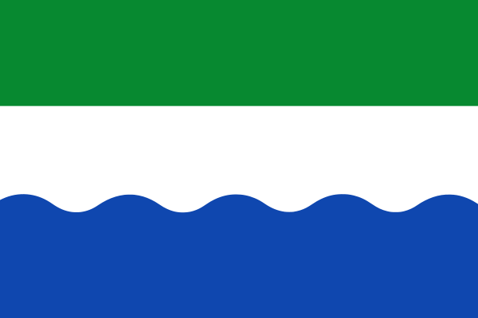

Wegbeheerders
=============

| Vlag | Wegbeheerder | Code | Gebied |
| :--- | :----------- | :--- | :----- |
|  | [Rijkswaterstaat](https://www.rijkswaterstaat.nl/) | [`oorg10004`](https://identifier.overheid.nl/tooi/id/oorg/oorg10004) | `NL` |
|  | [Provincie Groningen](https://www.provinciegroningen.nl/) | [`pv20`](https://identifier.overheid.nl/tooi/id/provincie/pv20) | `NL-GR` |
|  | Provincie Friesland → [Provincie Fryslân](https://www.fryslan.frl/) | [`pv21`](https://identifier.overheid.nl/tooi/id/provincie/pv21) | `NL-FR` |
|  | [Provincie Drenthe](https://www.provincie.drenthe.nl/) | [`pv22`](https://identifier.overheid.nl/tooi/id/provincie/pv22) | `NL-DR` |
|  | [Provincie Overijssel](https://www.overijssel.nl/) | [`pv23`](https://identifier.overheid.nl/tooi/id/provincie/pv23) | `NL-OV` |
|  | [Provincie Flevoland](https://www.flevoland.nl/) | [`pv24`](https://identifier.overheid.nl/tooi/id/provincie/pv24) | `NL-FL` |
|  | [Provincie Gelderland](https://www.gelderland.nl/) | [`pv25`](https://identifier.overheid.nl/tooi/id/provincie/pv25) | `NL-GE` |
|  | [Provincie Utrecht](https://www.provincie-utrecht.nl/) | [`pv26`](https://identifier.overheid.nl/tooi/id/provincie/pv26) | `NL-UT` |
|  | [Provincie Noord-Holland](https://www.noord-holland.nl/) | [`pv27`](https://identifier.overheid.nl/tooi/id/provincie/pv27) | `NL-NH` |
|  | [Provincie Zuid-Holland](https://www.zuid-holland.nl/) | [`pv28`](https://identifier.overheid.nl/tooi/id/provincie/pv28) | `NL-ZH` |
|  | [Provincie Zeeland](https://www.zeeland.nl/) | [`pv29`](https://identifier.overheid.nl/tooi/id/provincie/pv29) | `NL-ZE` |
|  | [Provincie Noord-Brabant](https://www.brabant.nl/) | [`pv30`](https://identifier.overheid.nl/tooi/id/provincie/pv30) | `NL-NB` |
|  | [Provincie Limburg](https://www.limburg.nl/) | [`pv31`](https://identifier.overheid.nl/tooi/id/provincie/pv31) | `NL-LI` |
|  | [Waterschap Rivierenland](https://www.waterschaprivierenland.nl/) | [`ws0621`](https://identifier.overheid.nl/tooi/id/waterschap/ws0621) | `NL` |
|  | HHS Hollands Noorderkwartier → [Hoogheemraadschap Hollands Noorderkwartier](https://www.hhnk.nl/) | [`ws0651`](https://identifier.overheid.nl/tooi/id/waterschap/ws0651) | `NL-NH` |
|  | Waterschap De Hollandse Delta → [Waterschap Hollandse Delta](https://www.wshd.nl/) | [`ws0655`](https://identifier.overheid.nl/tooi/id/waterschap/ws0655) | `NL-ZH` |
|  | HHS Schieland en de Krimpenerwaard → [Hoogheemraadschap van Schieland en de Krimpenerwaard](https://www.schielandendekrimpenerwaard.nl/) | [`ws0656`](https://identifier.overheid.nl/tooi/id/waterschap/ws0656) | `NL-ZH` |
|  | [Waterschap Scheldestromen](https://scheldestromen.nl/) | [`ws0661`](https://identifier.overheid.nl/tooi/id/waterschap/ws0661) | `NL-ZE` |
|  | [Staatsbosbeheer](https://www.staatsbosbeheer.nl/) | [`zb000142`](https://identifier.overheid.nl/tooi/id/zbo/zb000142) | `NL` |
|  | Spoorwegen → [ProRail](https://www.prorail.nl/) | [`oorg10007`](https://identifier.overheid.nl/tooi/id/oorg/oorg10007) | `NL` |
|  | PWN Waterleidingbedr Noord-Holland → [N.V. PWN Waterleidingbedrijf Noord-Holland](https://www.pwn.nl/) |  | `NL-NH` |
|  | Overige instanties in Schiphol → [Schiphol Nederland B.V.](https://www.schiphol.nl/nl/) |  | `NL-NH` |
|  | Havenbedrijf Rotterdam → [Havenbedrijf Rotterdam N.V.](https://www.portofrotterdam.com/nl) |  | `NL-ZH` |
|  | NV Westerscheldetunnel → [N.V. Westerscheldetunnel](https://www.westerscheldetunnel.nl/nl/) |  | `NL-ZE` |
|  | North Sea Port → [North Sea Port Netherlands NV](https://www.northseaport.com/) |  | `NL-ZE` |
