Wegbeheerders
=============

|      | Wegbeheerder | Gebied |
| :--- | :----------- | :----- |
| 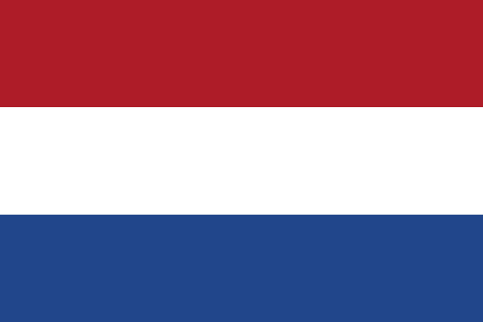 | [Rijkswaterstaat](https://www.rijkswaterstaat.nl/) | `NL` |
| 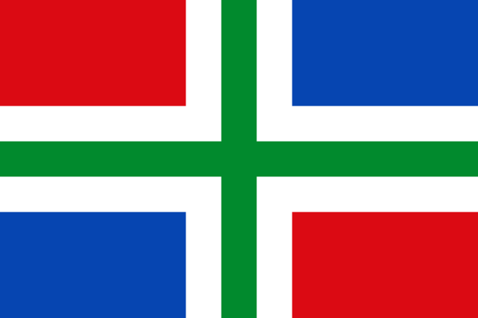 | [Provincie Groningen](https://www.provinciegroningen.nl/) | `NL-GR` |
| 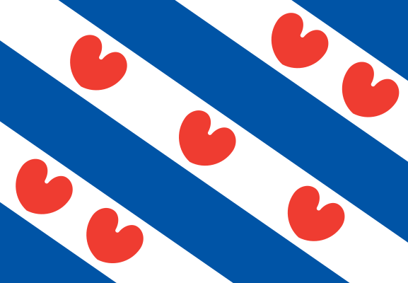 | Provincie Friesland → [Provincie Fryslân](https://www.fryslan.frl/) | `NL-FR` |
|  | [Provincie Drenthe](https://www.provincie.drenthe.nl/) | `NL-DR` |
| 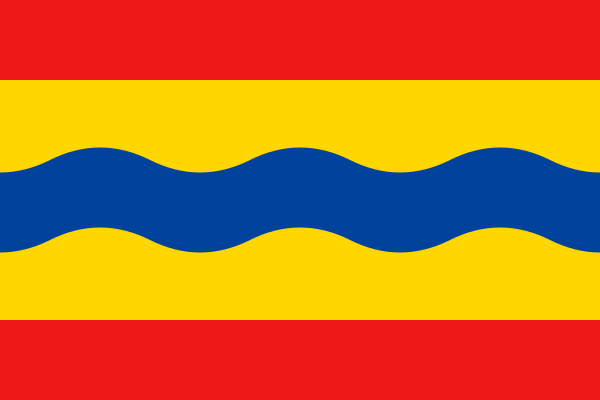 | [Provincie Overijssel](https://www.overijssel.nl/) | `NL-OV` |
| 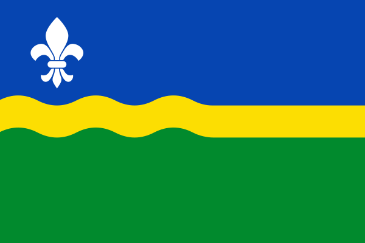 | [Provincie Flevoland](https://www.flevoland.nl/) | `NL-FL` |
| 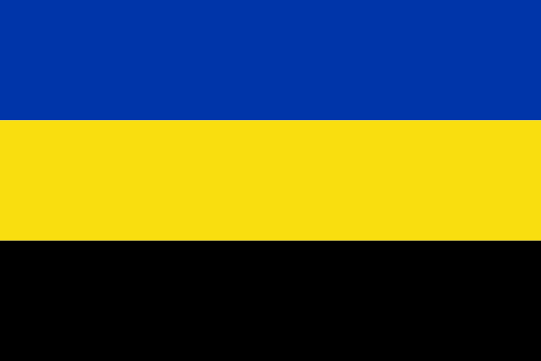 | [Provincie Gelderland](https://www.gelderland.nl/) | `NL-GE` |
|  | [Provincie Utrecht](https://www.provincie-utrecht.nl/) | `NL-UT` |
| 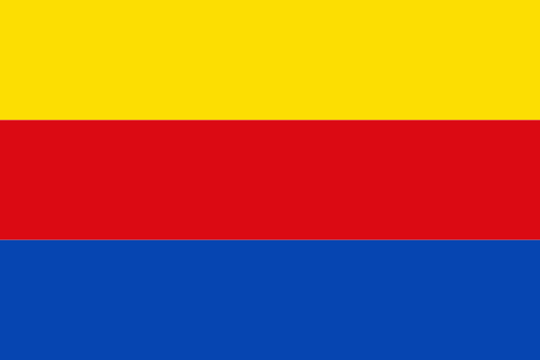 | [Provincie Noord-Holland](https://www.noord-holland.nl/) | `NL-NH` |
| 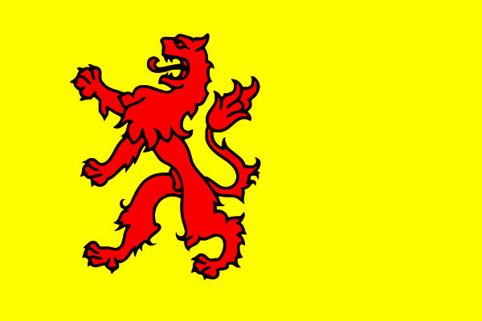 | [Provincie Zuid-Holland](https://www.zuid-holland.nl/) | `NL-ZH` |
| 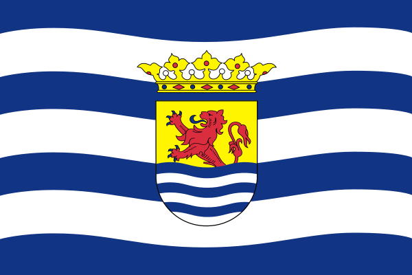 | [Provincie Zeeland](https://www.zeeland.nl/) | `NL-ZE` |
| 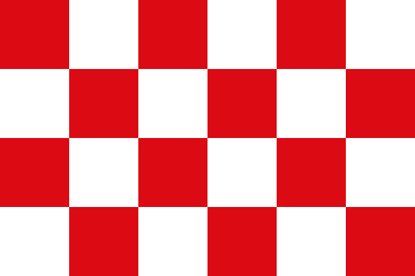 | [Provincie Noord-Brabant](https://www.brabant.nl/) | `NL-NB` |
| 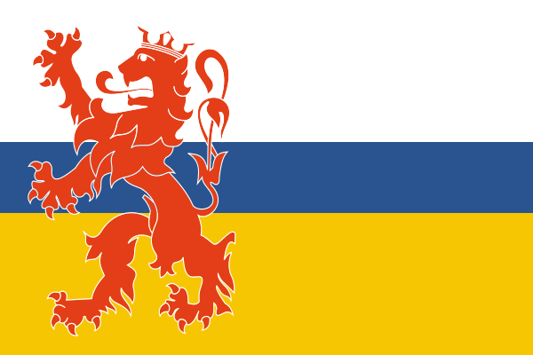 | [Provincie Limburg](https://www.limburg.nl/) | `NL-LI` |
|  | HHS Schieland en de Krimpenerwaard → [Hoogheemraadschap van Schieland en de Krimpenerwaard](https://www.schielandendekrimpenerwaard.nl/) | `NL-ZH` |
|  | [Waterschap Scheldestromen](https://scheldestromen.nl/) | `NL-ZE` |
|  | [Staatsbosbeheer](https://www.staatsbosbeheer.nl/) | `NL` |
|  | Spoorwegen → [ProRail](https://www.prorail.nl/) | `NL` |
|  | PWN Waterleidingbedr Noord-Holland → [N.V. PWN Waterleidingbedrijf Noord-Holland](https://www.pwn.nl/) | `NL-NH` |
|  | Overige instanties in Schiphol → [Schiphol Nederland B.V.](https://www.schiphol.nl/nl/) | `NL-NH` |
|  | Havenbedrijf Rotterdam → [Havenbedrijf Rotterdam N.V.](https://www.portofrotterdam.com/nl) | `NL-ZH` |
|  | NV Westerscheldetunnel → [N.V. Westerscheldetunnel](https://www.westerscheldetunnel.nl/nl/) | `NL-ZE` |
|  | North Sea Port → [North Sea Port Netherlands NV](https://www.northseaport.com/) | `NL-ZE` |
